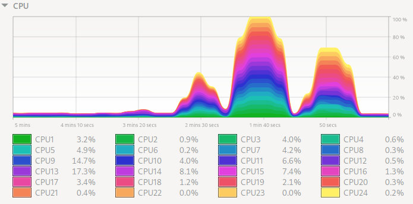

# SystemMonitorColors #

Generate and set colors for the CPU graph in the Gnome System Monitor application.

## Screenshot ##

This is with the "Stacked Area Chart" option selected in System Monitor.

## Usage ##

| Command                 | Purpose                                                     |
| :---------------------- | :---------------------------------------------------------- |
| `make check`            | Run unit tests                                              |
| `make test-colors.html` | Create an HTML file previewing the colors that will be used |
| `make set`              | Set the colors using `dconf`                                |
| `make stress`           | Run the `stress` program to max out the CPU graph           |

## Using without `nix` ##

If you don't have `nix` installed, comment out the `SHELL` and `.SHELLFLAGS` lines using `#`.

You will need to have the following installed:

* The `make` utility (GNU version)
* The `ghc` Haskell compiler with these Haskell packages available:
  * `Color`
  * `hspec`
  * `optparse-applicative`
  * `terminal-size`
* The `dconf` program (for `make set`)
* The `stress` program (for `make stress`)
